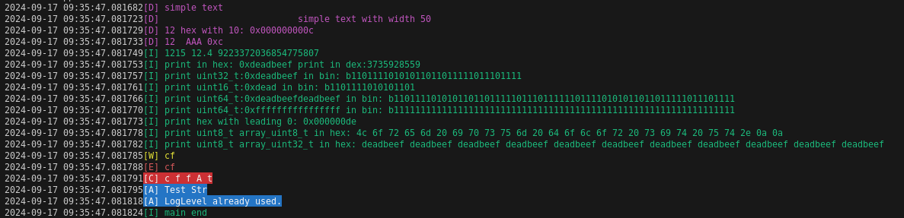

# Logger Utility

A simple, flexible, and color-coded logging utility for C++ applications.

## Features

- Multiple log levels (DEBUG, INFO, WARNING, ERROR, CRITICAL)
- Stream-based logging interface
- Color-coded output for better readability
- Easily configurable log level

## Files

- `logger.h`: Header file defining the Logger class and its functionalities.
- `color.h`: Header file for color definitions and utilities for terminal output.

## Usage

### Installation

To use the logger in your project, simply include the header files and compile the source file along with your project.


## Basic Example
```cpp
#include <iostream>
#include "logger.h"

int main() {
    logger::logger.setLogLevel(logger::debug);
    bool b = false;
    bool x = true;

    uint32_t AA = 0xDEADBEEF;
    uint16_t BB = 0xDEAD;
    uint64_t CC = 0xDEADBEEFDEADBEEF;
    uint64_t DD = UINT64_MAX;
    uint32_t deadbeef = 0xDEADBEEF;

    uint8_t array_uint8_t[] = {0x4C, 0x6F, 0x72, 0x65, 0x6D, 0x20, 0x69, 0x70, 0x73, 0x75, 0x6D, 0x20, 0x64, 0x6F, 0x6C, 0x6F, 0x72, 0x20, 0x73, 0x69, 0x74, 0x20, 0x75, 0x74, 0x2E, 0x0A, 0x0A};
    uint32_t array_uint32_t[] = {AA,AA,AA,AA,AA,AA,AA,AA,AA,AA,AA};
    
    logger::logger << logger::debug << "simple text" << logger::endl;
    logger::logger << logger::debug << logger::setw(50) << "simple text with width 50" << logger::endl;
    logger::logger << logger::debug << "12 hex with 10: " << logger::hex << logger::setw(10) << 12 << logger::dec << logger::endl;
    logger::logger << logger::debug << 12 << " " << " AAA " << logger::hex << 12 << logger::dec << logger::endl;
    logger::logger << logger::info << 12 << 15 << " " << 12.4 << " " << __LONG_LONG_MAX__ << logger::endl;
    logger::logger << logger::info << "print in hex: " << logger::hex << deadbeef << logger::dec << " print in dex:" << deadbeef << logger::endl;
    logger::logger << logger::info << "print uint32_t:" << logger::hex << AA << " in bin: " << logger::bit(AA) << logger::endl;
    logger::logger << logger::info << "print uint16_t:" << logger::hex << BB << " in bin: " << logger::bit(BB) << logger::endl;
    logger::logger << logger::info << "print uint64_t:" << logger::hex << CC << " in bin: " << logger::bit(CC) << logger::endl;
    logger::logger << logger::info << "print uint64_t:" << logger::hex << DD << " in bin: " << logger::bit(DD) << logger::endl;
    logger::logger << logger::info << "print hex with leading 0: " << logger::hex << logger::setw(8) << 0xDE << logger::dec<< logger::endl;
    logger::logger << logger::info << "print uint8_t array_uint8_t in hex: " << logger::array(array_uint8_t, sizeof(array_uint8_t)) << logger::endl;
    logger::logger << logger::info << "print uint8_t array_uint32_t in hex: " << logger::array(array_uint32_t, sizeof(array_uint32_t)/ sizeof(array_uint32_t[0])) << logger::endl;
    logger::logger << logger::warning << 12 << 15 << logger::endl;
    logger::logger << logger::error << 12 << 15 << logger::endl;
    logger::logger << logger::critical << 12 << " " << 15 << " " << b << " A " << x << logger::endl;

    logger::Logger::LogLevel new_log_level(60, Color::BG_BLUE, "A");
    logger::logger.setLogLevel(new_log_level);
    logger::logger << new_log_level << "Test Str" << logger::endl;

    try {
        logger::Logger::LogLevel new_log_level2(60, Color::BG_GREEN, "B");
    } catch (std::logic_error& e) {
        logger::logger << new_log_level << e.what() << logger::endl;
    }

    logger::logger.setLogLevel(logger::debug);
    logger::logger << logger::info << "main end" << logger::endl;

    return 0;
}

```

### Run Example
type
```shell
$ make run
```

</div>


## Log Levels
The logger supports the following log levels:

- DEBUG
- INFO
- WARNING
- ERROR
- CRITICAL

You can set the log level using `setLogLevel()` method:

```cpp
logger::logger.setLogLevel(logger::Logger::LogLevel::WARNING);
```

## Colored Output
The color.h file provides color modifiers to enhance the readability of log messages. Available colors include:

- Color::red
- Color::green
- Color::yellow
- Color::blue
- Color::magenta
- Color::reset (to reset to default color)

## Detailed Class and Method Documentation
`logger::Logger` **Class**
- **LogLevel**: Enum to define log levels (DEBUG, INFO, WARNING, ERROR, CRITICAL).
- **Logger()**: Constructor to initialize the logger.
- **operator<<**: Overloaded operator to handle different types of messages.
- **setLogLevel(LogLevel newLogLevel)**: Method to set the current log level.
- **end(logger::Logger& l)**: Ends the current log message and prints it if the log level is appropriate.
